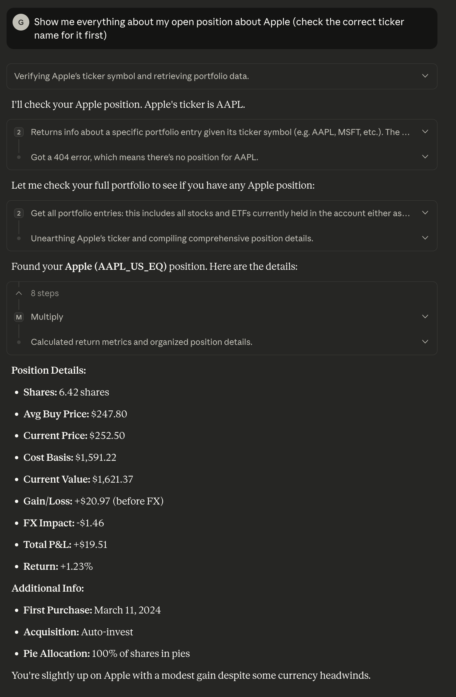

# MCP Server for 212 Trading

A Model Context Protocol (MCP) server that provides Claude with access to your 212 Trading account. This server allows you to interact with your 212 Trading ISA account through Claude, enabling you to check balances, view portfolios, place orders, and manage pies directly from your AI assistant.

Example query you can ask Claude:

## Features

- **Account Management**: Get account info, balances, and portfolio details
- **Trading Operations**: Place market, limit, stop, and stop-limit orders
- **Portfolio Management**: View holdings, check specific positions, and manage pies
- **Market Data**: Access available instruments, exchanges, and dividend information
- **Order Management**: View, cancel, and track orders
- **Pie Management**: Create, update, and delete investment pies

## Prerequisites

- Python 3.14 or higher
- A 212 Trading account with API access
- Claude Desktop application

## Quick Setup

1. **Clone the repository**:
   ```bash
   git clone https://github.com/giuliodambrosio/mcp-server-trading-212.git
   cd mcp-server-trading-212
   ```

2. **Run the setup script**:
   ```bash
   chmod +x setup.sh
   ./setup.sh
   ```

3. **Configure your environment**:
   - Copy `.env.template` to `.env`
   - Fill in your 212 Trading API credentials. [Instructions about creating your api key are available at Trading 212](https://helpcentre.trading212.com/hc/en-us/articles/14584770928157-Trading-212-API-key)

4. **Configure Claude Desktop** (see detailed instructions below)

## Manual Installation

If you prefer to set up manually:

### 1. Install Dependencies

```bash
# Using uv (recommended)
uv sync

# Or using pip
pip install -e .
```

### 2. Environment Configuration

Create a `.env` file in the project root with your 212 Trading API credentials:

```bash
cp .env.template .env
```

Edit `.env` and add your credentials:

```env
212_API_KEY_ID=your_api_key_id
212_API_KEY_SECRET=your_api_secret
212_API_BASE_LIVE_URL=https://live.trading212.com/api/v0
```

### 3. Test the Installation

```bash
python main.py
```

The server should start and be ready to accept MCP connections.

## Claude Desktop Configuration

To use this MCP server with Claude Desktop, you need to add it to your Claude Desktop configuration:

### Step 1: Locate Claude Desktop Config

**macOS**: `~/Library/Application Support/Claude/claude_desktop_config.json`
**Windows**: `%APPDATA%\Claude\claude_desktop_config.json`

### Step 2: Add MCP Server Configuration

Add the following configuration to your `claude_desktop_config.json`:

```json
{
  "mcpServers": {
    "212-trading": {
      "command": "python",
      "args": ["/absolute/path/to/your/mcp-server-212-trading/main.py"],
      "env": {
        "212_API_KEY_ID": "your_api_key_id",
        "212_API_KEY_SECRET": "your_api_secret",
        "212_API_BASE_LIVE_URL": "https://live.trading212.com/api/v0"
      }
    }
  }
}
```

**Important**: Replace `/absolute/path/to/your/mcp-server-212-trading/main.py` with the actual absolute path to your `main.py` file.

### Step 3: Restart Claude Desktop

After adding the configuration, restart Claude Desktop to load the new MCP server.

### Step 4: (Strongly recommended) Make sure Claude has a math tool
To enhance Claude's ability to handle numerical data from your trading account, ensure that the math tool is enabled in Claude Desktop and that the prompt discourages Claude from attempting doing any maths on its own (even Sonnet 4.5 it's very, very bad at it).
I've used [EthanHenrickson/math-mcp](https://github.com/EthanHenrickson/math-mcp) and it works perfectly.

## Usage

Once configured, you can interact with your 212 Trading account through Claude using natural language. Here are some example commands:

### Account Information
- "Show me my account balance"
- "What's my account information?"
- "Display my portfolio"

### Trading Operations
- "Buy 10 shares of AAPL at market price"
- "Place a limit order to buy 5 shares of MSFT at $300"
- "Set a stop order for 20 shares of TSLA at $200"

### Portfolio Management
- "What stocks do I own?"
- "Show me details for my Apple position"
- "What pies do I have?"
- "Analyse my portfolio and suggest changes"
- "Create a pie with the best stocks I can invest into"

### Market Data
- "What stocks are available on 212?"
- "Show me all available exchanges"
- "What dividends have I received?"

## Available Tools

The MCP server provides the following tools:

### Account & Portfolio
- `get_account_info()` - Get account details
- `get_balance()` - Get account balance
- `get_portfolio()` - Get all portfolio entries
- `get_portfolio_entry(ticker)` - Get specific portfolio entry

### Trading
- `place_market_order(ticker, quantity, extended_hours)` - Place market order
- `place_limit_order(ticker, quantity, limit_price, time_validity)` - Place limit order
- `place_stop_order(ticker, quantity, stop_price, time_validity)` - Place stop order
- `place_stop_limit_order(ticker, quantity, stop_price, limit_price, time_validity)` - Place stop-limit order
- `cancel_order(order_id)` - Cancel existing order

### Order Management
- `get_orders()` - Get all orders
- `get_order(order_id)` - Get specific order

### Market Data
- `get_instruments()` - Get all available instruments
- `get_instrument_tickers()` - Get list of available tickers
- `get_exchanges()` - Get available exchanges
- `get_paid_dividends()` - Get dividend history

### Pie Management
- `get_pies()` - Get all pies
- `get_pie(pie_id)` - Get specific pie
- `create_pie(name, dividend_destination, instrument_shares, end_date, goal)` - Create new pie
- `update_pie(pie_id, name, dividend_destination, instrument_shares, end_date, goal)` - Update pie
- `delete_pie(pie_id)` - Delete pie

## Configuration Parameters

### Order Types
- **Market Orders**: Execute immediately at current market price
- **Limit Orders**: Execute only at specified price or better
- **Stop Orders**: Trigger when price reaches stop level
- **Stop-Limit Orders**: Trigger at stop price but execute at limit price

### Time Validity Options
- `DAY` - Order valid for the current trading day
- `GOOD_TILL_CANCEL` - Order valid until manually cancelled

### Dividend Destination Options
- `CASH` - Dividends paid to cash account
- `REINVEST` - Dividends automatically reinvested

## Troubleshooting

### Common Issues

1. **"Server not found" error in Claude Desktop**
   - Verify the absolute path in your configuration
   - Ensure Python is in your PATH
   - Check that all dependencies are installed

2. **API authentication errors**
   - Verify your API credentials in the `.env` file
   - Ensure you're using the correct API base URL
   - Check that your 212 Trading account has API access enabled

3. **Rate limiting**
   - The server automatically handles rate limiting
   - If you encounter issues, wait a moment and try again

4. **Order placement failures**
   - Verify the ticker symbol exists on 212 Trading
   - Check market hours for the instrument
   - Ensure sufficient account balance for purchases

### Debug Mode

To run the server in debug mode:

```bash
python -u main.py
```

This will show detailed output and help identify issues.

## Security Notes

- Keep your API credentials secure and never share them
- The `.env` file contains sensitive information - don't commit it to version control
- Consider using environment variables instead of the `.env` file in production

## Contributing

Contributions are welcome! Please feel free to submit issues, feature requests, or pull requests.

## License

This project is licensed under the MIT License - see the LICENSE file for details.

## Support

For issues related to:
- **This MCP server**: Open an issue in this repository
- **212 Trading API**: Contact 212 Trading support
- **Claude Desktop**: Check Claude Desktop documentation
